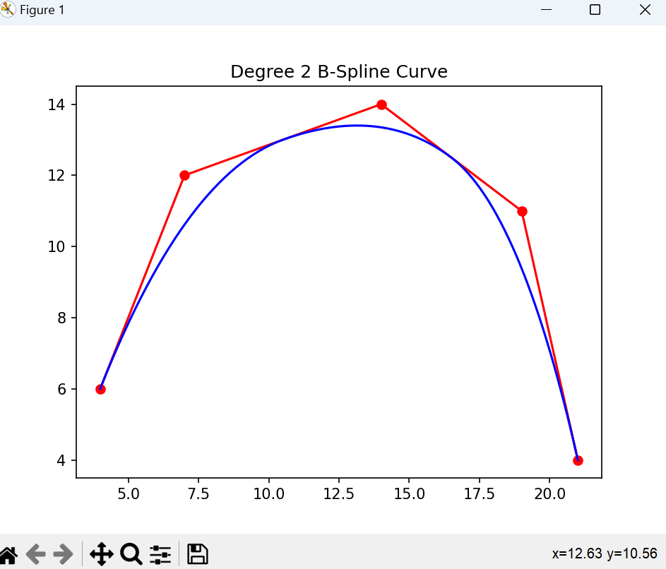

# b-spline_2_degree
 create a degree 2 B-Spline curve, given control point.
## B-Spline
### Conception

A B-Spline, short for Basis Spline, is a mathematical curve defined by a set of control points and a degree, which determines the curve's smoothness. B-Splines are widely used in computer graphics, computer-aided design (CAD), and animation due to their flexibility and ease of manipulation.

#### Key Characteristics of B-Splines:
1. Control Points: These are a set of points that influence the shape of the curve. The curve does not necessarily pass through these points (except in certain cases like Bezier curves, which are a special case of B-Splines).

2. Degree: This is the degree of the polynomial that defines the segments of the spline. A higher degree means a smoother curve.

3. Knot Vector: This is a sequence of parameter values that determines how the control points influence the B-Spline curve. The knot vector can be uniform (equally spaced) or non-uniform.

4. Local Control: Adjusting one control point affects the shape of the curve only in a local region around that point. This property is particularly useful in design and animation, as it allows for localized adjustments without altering the entire shape.

5. Smoothness: B-Splines can represent complex shapes with smooth curves, which is essential in many graphics and modeling applications.

6. Versatility: They can represent both open and closed curves, and by adjusting the control points and knot vector, a wide variety of shapes can be created.

#### Calculation

The B-Spline basis function `N_{i,0}(t)` is defined as:

- `1` if `T_i <= t < T_{i+1}`
- `0` otherwise

Given a B-spline of degree  $`\ n `$ with $`\ m `$ control points, the knot vector $`\ K `$ can be defined as follows:
```math

 \mathbf{K} = \{ k_0, k_1, ..., k_{m+n+1} \} 
```

where the knot vector must satisfy the non-decreasing condition:
```math

 k_i \leq k_{i+1}
```

For a clamped B-spline, which means that the curve passes through the first and last control points, the first \( n+1 \) knots and the last \( n+1 \) knots are typically equal:

```math

 k_0 = k_1 = ... = k_n , 

 k_{m+1} = k_{m+2} = ... = k_{m+n+1} 
```

where $`\ k_0 `$  and $`\ k_{m+n+1}  `$ are the lower and upper bounds of the parameter domain, respectively.


#### Noted

- Overlap at Knots: B-spline basis functions are defined on half-open intervals to ensure that at any given parameter t, exactly k+1 basis functions are non-zero (where k is the degree of the B-spline). This avoids overlaps where two basis functions could both be 1 at a knot point.

- End Conditions: At the end of the knot vector, the B-spline curve should reach the last control point. If you change the condition to be inclusive at the end of the interval, it might cause unexpected behavior at the ends of the curve, especially since the last point of the curve is defined by the last control point and the last non-zero basis functions.

#### template




### Application

Computer Graphics and Animation: For creating smooth and complex shapes, animations, and paths for objects to follow.

Computer-Aided Design (CAD): For designing curves and surfaces in automotive, aerospace, and architectural design.

Data Visualization: For smooth curve fitting in statistical graphics and data visualization.


### Types of B-Splines:

Uniform B-Splines: The knots in the knot vector are equally spaced.

Non-Uniform B-Splines (NURBS): The knots can have varying distances between them, providing more control over the shape of the curve.
